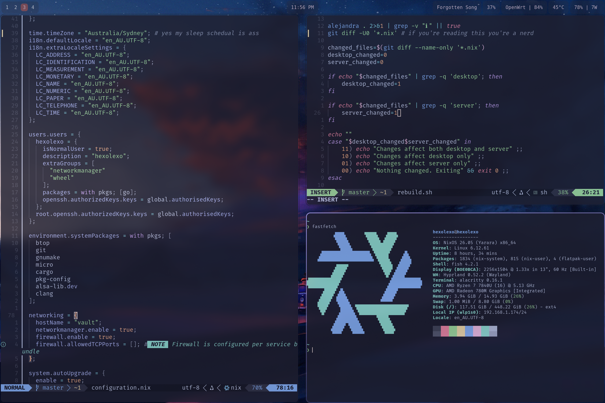

# nix-infra

NixOS configuration managing my desktop (hexolexo) and homelab server (vault) with deploy-rs deployments

**hexolexo** (desktop)
- Hyprland + Wayland
- Colemak layout with custom keyd bindings
- Development environment (Go, Rust, Nix, OpenTofu)
- Gaming (Steam, Prism Launcher)
- AMD GPU with ROCm

**vault** (server)
- Minecraft server
- Git server (soft-serve)
- Wireguard mesh node
- Auto-updates at 16:00 daily with reboot (I recommend disabling auto reboots if you run this yourself)
- And a handful of other services I've disabled for (mainly) security reasons

## Requirements

- NixOS 25.05+
- SSH access to server (for deploy-rs)
- Personal repo at `git@localgit/secrets.git` (So ideally you don't dox your IP on git)
```nix
{
    description = "IP addresses";
    outputs = {self}: {
        HomeIP = "1.2.3.4";
        ServerIP = "10.0.0.1"
    }
}
```

## ./rebuild.sh

This script was a damn nightmare but here it is
    It starts by opening nvim letting you make edits to the config
    Then checks for diffs and if there are none exits early
    Otherwise formats with alejandra and determines what config changed
    Finally rebuilds only the machine configs that got changed before pushing to git

## Screenshots



