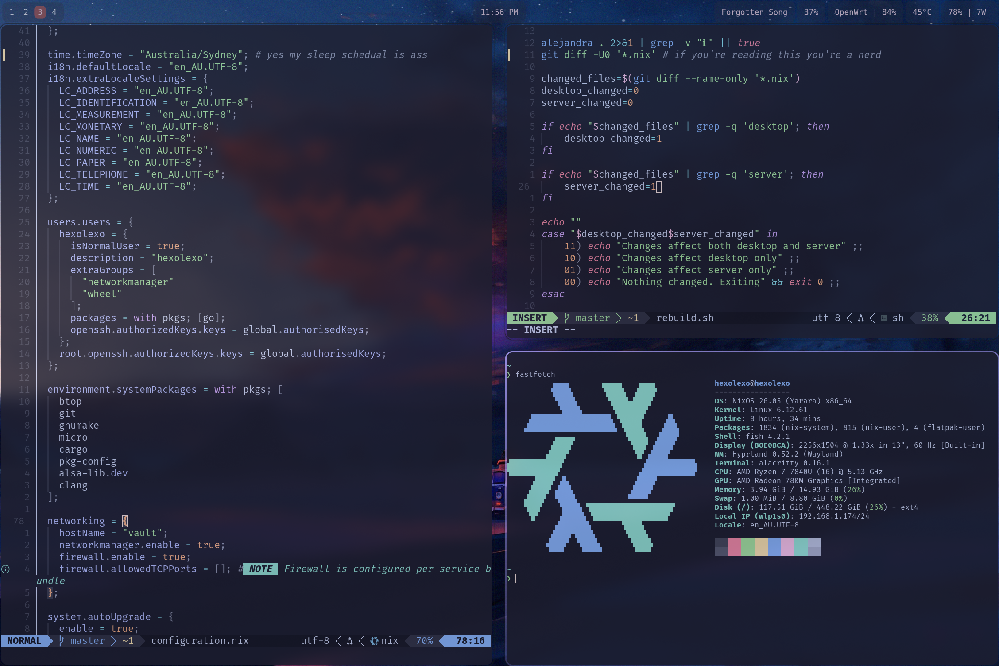

# nix-infra
Time of writing:
Extensible NixOS configuration management for my desktop (hexolexo) and homelab server (vault) with deploy-rs deployments and single input installation via `reinstall.sh`

**hexolexo** (desktop)
- Hyprland + Wayland
- Colemak layout with custom keyd bindings
- Development environment (Alacritty, Nvim, Go, Rust, Nix, OpenTofu, virt-manager)
- Gaming (Steam, Prism Launcher)

**vault** (server)
- SSH + fail2ban for minimal vulnrable footprint
- ZFS file system setup via disko
- Foregjo git server + Forgejo action runner with github action compatibility through [catthehacker's full-22.04 docker container](https://github.com/catthehacker/docker_images)
- Wireguard hub and spoke architecture
- Copyparty over Wireguard
- Auto-updates at 16:00 daily with reboot
- Aprox 13 of other services disabled for security reasons

## Requirements
I will advise against using this setup wholesale but taking parts you find worthwhile such as the flake setup or specific modules such as `keyd.nix`, `copyparty.nix` or `minecraft/modded.nix`
- NixOS 25.05+
- SSH access to server (for deploy-rs)
- Personal repo at `path:/home/hexolexo/Programming/sysadmin/secrets` (You may wish to modify this path at the root flake and each machines flake)
```nix
{
    description = "IP addresses";
    outputs = {self}: {
        HomeIP = "1.2.3.4";
        ServerIP = "10.0.0.1"
        I2P_Port = 12345
    }
}
```


## Screenshots


Background is "Under the Night Sky" from [Bis Biswas](https://imbis.artstation.com/projects/2x6z3a)

